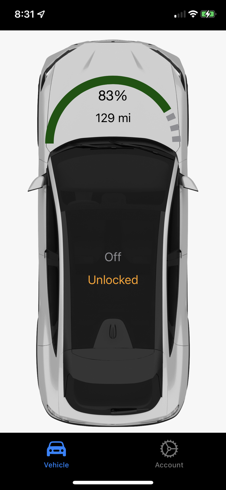

# overpass

Alternative for Ford Pass iOS App that focuses on Unique considerations for Electric Vehicles specifically starting with the Mustang Mach-e

## Currrent Features

* Main Battery charge (SoC)
* Estimated Range (GOM)
* Lock status
* Running status
* Pressing Engine Running *Off* button whill initate a remote start
* Pressing Lock indicator button will toggle the lock state

## App Goals

* Create reliable easy-to-use app that focuses on Electric Vehicles.
* Expose features in a way that makes the app uncluttered and elegant.

## Development Goals

Use the latest features of Swift 5.5 and XCode 13 etc. This will improve the readability and performance.

